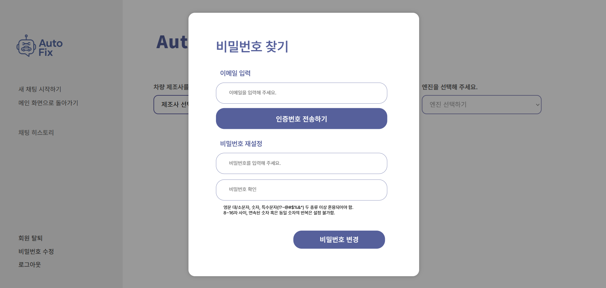
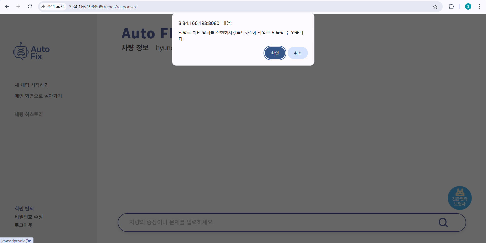
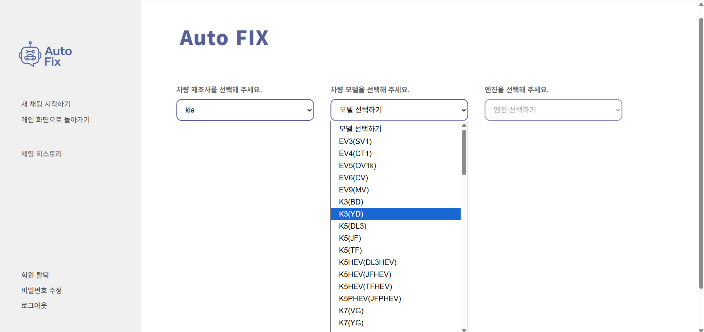
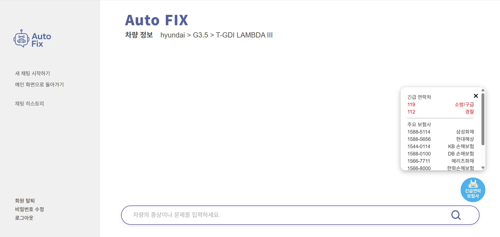

# SKN17-3rd-Team6
> SK네트웍스 Family AI캠프 17기 - 4차 프로젝트 6팀  
  개발 기간: 2025.10.24 ~ 2025.10.27

 

# 🔖 Contents
1. [팀 소개](#1-팀-소개)
2. [프로젝트 개요](#2-프로젝트-개요)
3. [기술 스택 및 구조](#3-기술-스택-및-구조)
4. [시스템 구성도](#4-시스템-구성도)
5. [요구사항 정의서](#5-요구사항-정의서)
6. [화면설계서](#6-화면설계서)
7. [WBS](#7-WBS)
8. [테스트 계획 및 결과 보고서](#8-테스트-계획-및-결과-보고서)
9. [수행결과(테스트/시연 페이지)](#9-수행결과(테스트/시연-페이지))
10. [한계점](#10-한계점)
11. [향후 개선 계획](#11-향후-개선-계획)
12. [한 줄 회고](#12-한-줄-회고)

 
 

---

# 🚗 Auto Fix: 차량 정비 챗봇 with LLM + RAG

> **정확한 진단, 신속한 안내 — RAG 기반 차량 정비 챗봇 "Auto Fix"**

 

# 1. 👥 팀 소개

**팀명: RAGents**  
> RAG + Agents = **RAGents**

LLM과 RAG 기술을 능숙하게 다루며, 사용자 맞춤형 정보 제공이 가능한 지능형 챗봇을 개발하는 팀입니다.  
Auto Fix 프로젝트를 통해 실제 자동차 정비의 문제를 해결하는 **정비 관련 특화형 AI 솔루션**을 지향합니다.

### 팀 구성원
|||||
|---|---|---|---|
| 양정민 | 전상아 | 주수빈 | 최동현 |
| [@Yangmin](https://github.com/Yangmin3)| [@sang-a-le](https://github.com/sang-a-le) | [@Subin-Ju](https://github.com/Subin-Ju) | [@donghyun4957](https://github.com/donghyun4957) |

 

------

# 2. 🧠 프로젝트 개요

## 💡Auto Fix는 현대/기아 GSW 정비 매뉴얼과 외부 문서 데이터(Naver 블로그, 지식인 등)를 연계한 Retrieval-Augmented Generation(RAG) 기반의 차량 정비 챗봇입니다.  
차량에서 발생할 수 있는 **이상 증상** (예: 진동, 소음, 경고등 점등 등)에 대해 사용자가 자연어로 질문하면, Auto Fix는 관련 문서를 기반으로 정확하고 신뢰도 높은 정비 진단 및 대응 방안을 제공합니다.

 

## ✅ 프로젝트 필요성

**📰 관련 기사**

|  |  |
|---------------------------|---------------------------|
|[소비자민원평가-자동차; AS에 민원 집중](https://www.consumernews.co.kr/news/articleView.html?idxno=739584) | [반복되는 엔진경고등에도 원인 못찾고 방치... 뒤늦게 고장 판정되면 시간ㆍ비용은 소비자 몫](https://www.consumernews.co.kr/news/articleView.html?idxno=739584) |

2025년 7월 기준, 대한민국 자동차 등록 수는 2천640만 8천대로 집계되었습니다. 대한민국 전체 인구의 절반 가량이 차량을 보유하고 있으며, 그 중 현대와 기아 자동차는 국산차 전체 판매 점유율의 92%를 차지하는 만큼 그 규모가 매우 큽니다.  

현대 자동차와 기아 자동차는 최대 판매 규모에 걸맞은 우수한 민원 처리 체계를 갖추고 있으나, 그럼에도 차량에 고장이나 이상 증상이 발생하면 소비자들은 **정확한 원인을 파악하기 위해 인터넷을 검색하거나 서비스 센터를 방문하는 등 시간과 노력**을 들여야 합니다. 또한 원인을 어느 정도 파악하고 있다 하더라도, 당장 차량을 정비소에 맡겨 진단을 받아야 할 정도로 **심각한 문제인지 일반 차량 운전자가 파악하기 어렵다**는 문제가 있습니다.

 

**📝 설문 조사** 

 위의 설문 조사는 2025년 10월 24일(금)부터 26일(일)까지 진행한 자동차 고장 및 이상 증상 진단 챗봇 필요성 조사 내용입니다. 

 

설문 응답자 29명 중, 약 72%에 해당하는 21명이 차량 고장으로 인해 곤란한 상황을 경험한 적 있다는 것을 알 수 있습니다. 

|  |  |
|:--:|:--:|
| 설문 4 | 설문 5 |

 추가적인 설문 응답에서도 볼 수 있듯이, 
 차량 고장 간 조치 시 가족, 지인에게 도움을 요청하거나 인터넷을 검색하는 등 비교적 부정확한 정보에 의존해 차량 고장 원인을 찾는 경우가 많고, 정확한 고장 요인 파악에 어려움이 있다고 응답하였습니다. 

저희의 챗봇은 이러한 문제를 겪고 있는 전국 약 2천 650만 명의 차량 보유자를 위해, 언제 어디서든 **쉽고 간편하게 고장 원인에 대해 일반 자동차 이용자도 파악할 수 있게 돕는** 챗봇을 만들게 되었습니다.  

- **블로그/지식인 크롤링 내용**을 통해 보다 다양한 차량 고장 관련 키워드의 정보를 학습하고  
- **현대자동차/기아자동차 공식 GSW 문서**를 통해 높은 신뢰도를 갖는 정확한 고장 원인 진단 및 해결 방법에 대해 안내할 수 있도록 하며
- 사용자가 서비스 센터에서 고장 진단 및 처리를 받을 시 **정확한 이해**를 돕고자 했습니다.

 

## 🎯 프로젝트 목표
- 운전자: 정비소 방문 전 **이상 현상에 대한 원인 파악 가능**
- 정비 효율: **문제 사전 파악 → 불필요 방문 감소**
- 데이터적 측면: **기업 매뉴얼 + 사용자 경험 데이터 융합**
- 기술적 확장성: **추후 다른 브랜드 차량 GSW·포럼 데이터로 확장 가능**

 
 

----------

# 3. 💡 기술 스택 및 구조

| 영역 | 기술 / 도구 |
|---------------------|-------------------------------------------------------------------------------------------|
| **Language ✍️** |      |
| **Framework / Backend ⚙️** |   |
| **Infra / Deployment ☁️** |    |
| **Tools 🪛** |   |
| **Demo 💡** |  |
| **Collaborate 🔧** |    |

 
 

-----

# 4. 시스템 구성도

 
 

------

# 5 요구사항 정의서

[요구사항 정의서](https://www.notion.so/ohgiraffers/28f649136c118010b1b6cd63e52f7ee7?v=28f649136c1181129b0b000c8774a5b7)

 
 

-----

# 6. 화면설계서

[화면설계서🗂️](image/화면구현서.pdf)  
[화면설계서🔗](https://docs.google.com/presentation/d/1YsRjiNc_LpCM53-yZUm3KXioDAjvZ7RWwRuu7Rhqx_A/edit?usp=sharing)

 
 

------

# 7. WBS

 
 

------

# 8. 테스트 계획 및 결과 보고서
   
[테스트 계획서](https://www.notion.so/ohgiraffers/298649136c11804ebb7ec59c06411cea?v=298649136c11818b8759000cbfa455c3)
 

   
[테스트 결과서](https://www.notion.so/ohgiraffers/298649136c1180189c8dec5feedd98fc?v=298649136c1181aa94a2000caac161f0)

 
 

------

# 9 수행결과(테스트/시연 페이지)

<!-- 
 -->

  
  
  
  
  
  
  
  

  
[AutoFix🛠️](http://3.34.166.198:8080/chat/main/)

 
 

----------------

# 10. 한계점 및 향후 개선 계획 

디자인
- 비밀번호 찾기 / 변경창 화면구현서 디자인과 불일치(화면설계서 상 모달로 예정되어있던 부분을 버튼 형식으로 구현) → 추가적인 기능 개선 예정 (모달로 변경)
- 토글버튼 누르는 창과 채팅창이 분리되어있음 → 추가적인 기능 개선 예정 (모달로 변경)

기능
- 히스토리 내역 부재
- EC2 -> RDS 데이터 편집 불가로 인한 회원가입 기능 부재
- 웹서비스이다보니 자동차에 탑재를 못해서 주행 중 서비스에 한계
- 사용자 정보 수집 개인정보 활용에 대해 미고지 → 개인정보 활용에 대한 페이지 추가 예정
- 시간 상 이유로 채팅 히스토리 저장 기능은 미탑재된 상태 → 추가적인 기능 개선 예정 (히스토리 저장, 상세조회 기능 개발)

 
 

---------------

# 11.✨ 한 줄 회고

| 이름 | 한 줄 회고 |
|:------:|-------------|
| 최동현 | 로컬 환경에서는 잘 작동하던 기능들이 클라우드 배포 환경으로 옮기자 여러 문제가 발생했고, 이를 해결하는 데 많은 시간이 걸렸다. 그러나 이 과정을 통해 배포의 전반적인 절차를 직접 경험할 수 있었고, 로컬 개발 단계에서도 배포 환경의 제약사항과 설정 차이를 미리 고려해야 함을 깨달았다. |
| 양정민 | 이번 자동차 정비 웹페이지 챗봇 프로젝트에서는 전체적인 큰 틀과 구조 설계에는 기여했지만, 세세한 기능 구현과 프론트·백엔드 작업에는 상대적으로 참여가 부족했던 점이 아쉬었다. 피그마를 통해 페이지 디자인과 UI/UX 흐름을 이해할 수 있었고, 팀원들의 적극적인 도움 덕분에 데이터 처리와 챗봇 로직 구현이 원활히 진행될 수 있었다. 이번 경험을 통해 구조적 사고, 디자인과 구현의 연계, 팀 협업의 중요성을 배우는 동시에, 앞으로는 프론트엔드와 백엔드 양쪽 모두에서 실질적으로 기여할 수 있는 역량을 키워야겠다는 필요성을 느꼈다. |
| 전상아 | Html과 css 작성 시 많은 공부가 필요했지만 요구사항 명세서 작성부터 배포까지 웹 개발의 흐름을 직접 구현할 수 있었던 좋은 기회였다. |
| 주수빈 | 짧은 시간 동안 요구사항 명세서, 화면 설계서, 그리고 이를 바탕으로 한 웹서비스 제작 및 배포의 전 과정을 다 거치면서 설계와 구현의 중요성을 많이 배웠다. 특히 설계가 깊고 자세하면 자세할수록 구현 과정에서의 고민은 줄어들지만, 이를 구현할 절대적인 시간의 확보 또한 마감 기한에 맞춘 웹 배포 과정에서 반드시 준수해야 할 사항임을 몸소 느낄 수 있었다. 또한 피그마와 화면 구현을 모두 진행해보니, UI/UX 디자이너와 개발자 사이의 고뇌를 체험할 수 있었고, 피그마를 통한 화면 구현서 작성 시에는 개발자의 입장을 고려해야 함을, 또 개발자의 입장에서는 작성된 화면 구현서의 내용을 모두 준수할 수 있는 능력을 갖춰야겠다는 생각이 들어 추후 실력 향상을 해야겠다는 열정을 끌어올리는 발판이 된 프로젝트인 것 같다. |
